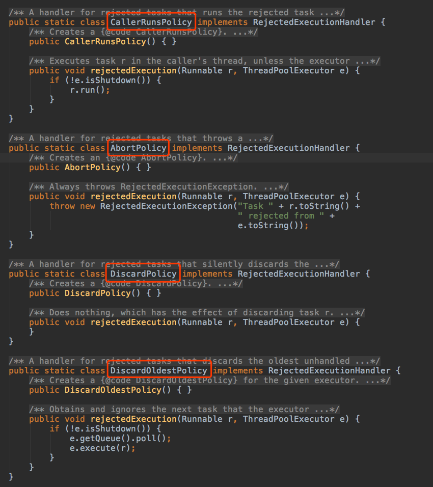
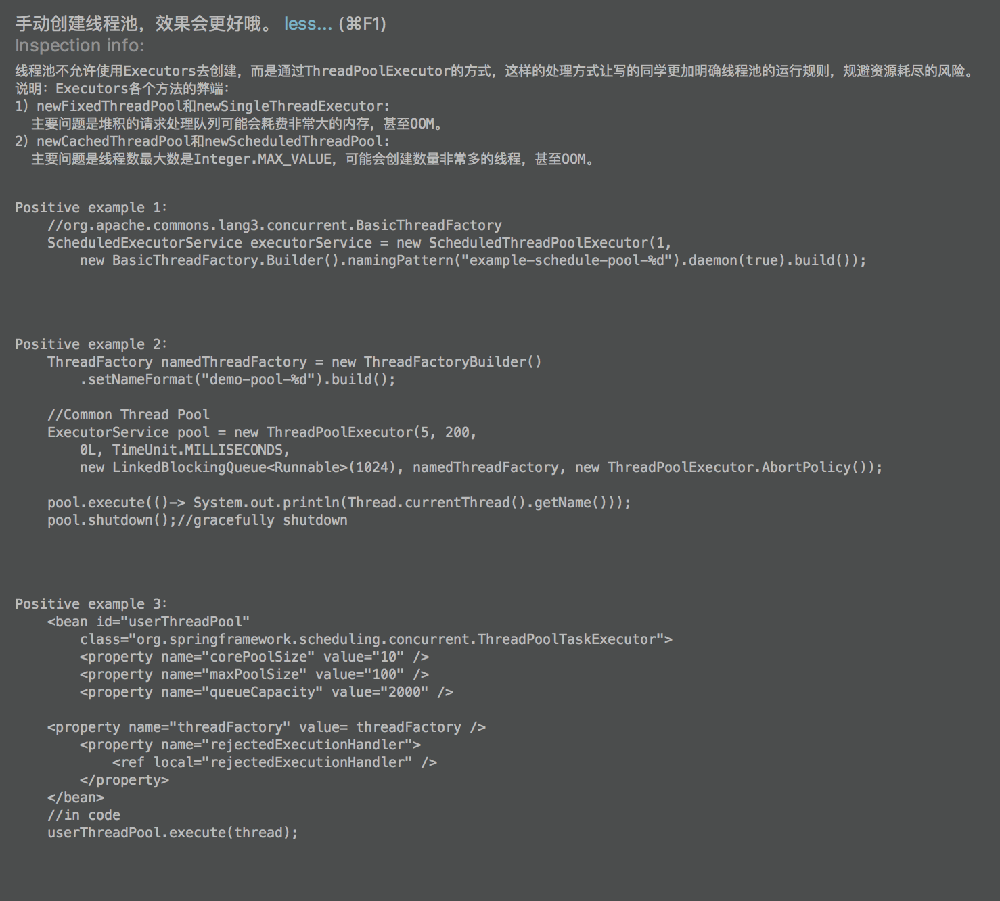
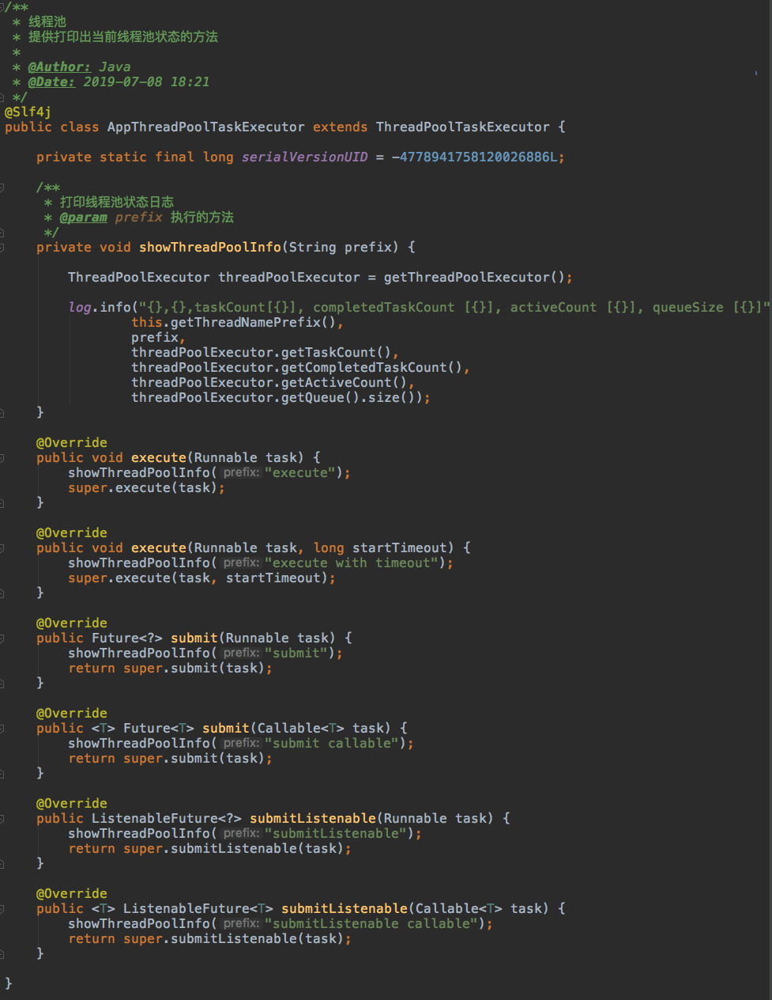
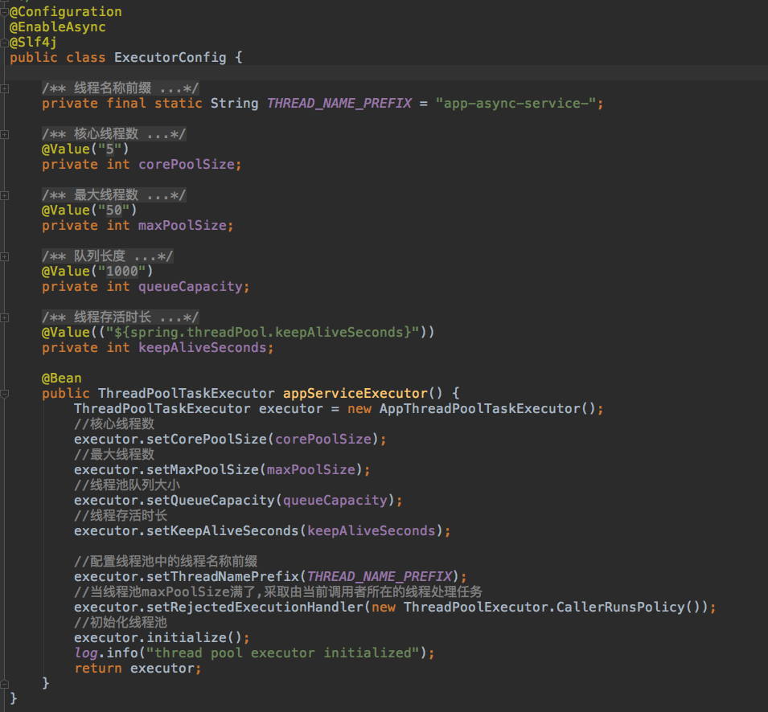

###线程池
线程池：顾名思义就是把一堆线程放到一个池子里面去。使用线程的时候不需要创建直接从池子里面拿一个，用完之后不需要释放线程，直接放回池子里就可以了。这样带来的好处有：
- 线程复用
- 避免了线程创建和销毁的性能开销
- 线程的创建和具体任务的执行是完全分开的
- ...

Java自JDK1.5以后便推出了创建线程池的几种方式，根据不同的场景要求可以创建不同的线程池：
```java
//创建一个固定线程数的线程池
Executors.newFixedThreadPool(int nThreads);

//创建一个只有单个线程的线程池（顺序执行一些任务）
Executors.newSingleThreadExecutor();

//创建一个无限线程的线程池
Executors.newCachedThreadPool();
```


查看这三个方法的源码：
```java
public static ExecutorService newFixedThreadPool(int nThreads) {
    return new ThreadPoolExecutor(nThreads, nThreads,
                                  0L, TimeUnit.MILLISECONDS,
                                  new LinkedBlockingQueue<Runnable>());
}
```

```java
public static ExecutorService newSingleThreadExecutor() {
    return new FinalizableDelegatedExecutorService
        (new ThreadPoolExecutor(1, 1,
                                0L, TimeUnit.MILLISECONDS,
                                new LinkedBlockingQueue<Runnable>()));
}
```

```java
public static ExecutorService newCachedThreadPool() {
    return new ThreadPoolExecutor(0, Integer.MAX_VALUE,
                                  60L, TimeUnit.SECONDS,
                                  new SynchronousQueue<Runnable>());
}
```

实际上都是ThreadPoolExecutor这个类来创建的。点击查看java.util.concurrent.ThreadPoolExecutor源码查看这个构造方法：
```java
public ThreadPoolExecutor(int corePoolSize,
                              int maximumPoolSize,
                              long keepAliveTime,
                              TimeUnit unit,
                              BlockingQueue<Runnable> workQueue) {
        this(corePoolSize, maximumPoolSize, keepAliveTime, unit, workQueue,
             Executors.defaultThreadFactory(), defaultHandler);
    }
```
可以看到这里面有几个核心参数：
- corePoolSize：线程池的基本大小
- maximumPoolSize：线程池的最大线程数
- keepAliveTime：线程空闲后的存活时间，时间单位为unit
- workQueue：用于存放任务的阻塞队列
- threadFactory：用于创建线程的工厂
- handler：当线程池和队列都满了之后的任务处理策略

***
#####问题：核心线程池的大小配置多少合适？

这个问题经过各位前辈大佬的各种测试，总结出来如下两条经验：
* IO密集型任务：2*CPU数，因为IO密集型任务，线程不是一直在运行，所以可以配置多一点
* CPU密集型任务：因为一直在使用CPU，所以要保证线程数不能太多，可以CPU数+1

实际使用过程中，如果不好判断，可以基于这两个数字进行压测，比较得出最佳配置。

***
#####问题：handler处理策略都有哪些？

当线程池满了并且队列已经满了，这个时候线程池是无法处理和接收任务的，因此就有处理新进来的任务策略：
1. AbortPolicy：默认的策略，直接拒绝，抛出RejectedExecutionException异常；
2. CallerRunsPolicy：新任务交给任务发起者自己执行；
3. DiscardPolicy：新任务直接抛弃，无任何反应；
4. DiscardOldestPolicy：从队列里面抛弃head的一个任务，并再次执行此任务；
5. 自定义策略：实现RejectedExecutionHandler这个接口类就可以了。
***

那是不是我们想用线程池的时候，直接这样就可以了呢？
```java
//通过Executors创建一个CachedThreadPool
private ExecutorService executor = Executors.newCachedThreadPool();

```
显然这是不可以的，首先这个线程池千万不能在方法里面直接new，不然会把你机器的内存慢慢吃没的。因为每一次的创建线程池都没有得到正确的释放，即使这个方法结束了。那是不是直接当做类变量就可以了？这样也是不行的。

阿里巴巴《Java开发手册》已经做了明确的说明：

###优雅的使用线程池：






可以看出来是在springboot框架中创建了一个线程池bean，这样在所有需要用到线程池的地方直接：
```java
@Resource(name = "appServiceExecutor")
private Executor appServiceExecutor;

//使用
appServiceExecutor.execute(() -> doTask());
```


