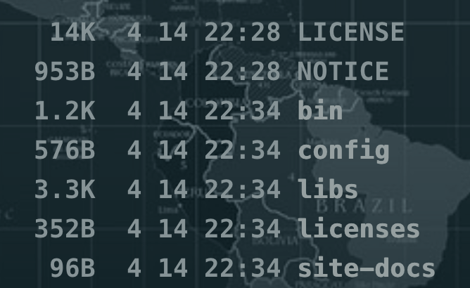

# KafKa入门安装
[Kafka官网](https://kafka.apache.org/)


实验环境：
```shell script
MacBook Pro (16-inch, 2019)
处理器 2.3 GHz 八核Intel Core i9
内存 16 GB 2667 MHz DDR4
```

下载最新版本：
https://kafka.apache.org/downloads

当前最新版本（2021-09-06）
```shell script
wget https://dlcdn.apache.org/kafka/2.8.0/kafka_2.13-2.8.0.tgz
```

下载后解压:
```shell script
tar -zxvf kafka_2.13-2.8.0.tgz
```
解压后的文件目录:



启动ZK：
```shell script
bin/zookeeper-server-start.sh config/zookeeper.properties
```
等待输出日志：
```shell script
[2021-09-07 10:52:05,884] INFO Created server with tickTime 3000 minSessionTimeout 6000 maxSessionTimeout 60000 datadir /tmp/zookeeper/version-2 snapdir /tmp/zookeeper/version-2 (org.apache.zookeeper.server.ZooKeeperServer)
[2021-09-07 10:52:05,901] INFO Using org.apache.zookeeper.server.NIOServerCnxnFactory as server connection factory (org.apache.zookeeper.server.ServerCnxnFactory)
[2021-09-07 10:52:05,904] INFO Configuring NIO connection handler with 10s sessionless connection timeout, 2 selector thread(s), 32 worker threads, and 64 kB direct buffers. (org.apache.zookeeper.server.NIOServerCnxnFactory)
[2021-09-07 10:52:05,913] INFO binding to port 0.0.0.0/0.0.0.0:2181 (org.apache.zookeeper.server.NIOServerCnxnFactory)
[2021-09-07 10:52:05,931] INFO zookeeper.snapshotSizeFactor = 0.33 (org.apache.zookeeper.server.ZKDatabase)
[2021-09-07 10:52:05,935] INFO Snapshotting: 0x0 to /tmp/zookeeper/version-2/snapshot.0 (org.apache.zookeeper.server.persistence.FileTxnSnapLog)
[2021-09-07 10:52:05,938] INFO Snapshotting: 0x0 to /tmp/zookeeper/version-2/snapshot.0 (org.apache.zookeeper.server.persistence.FileTxnSnapLog)
[2021-09-07 10:52:05,950] INFO PrepRequestProcessor (sid:0) started, reconfigEnabled=false (org.apache.zookeeper.server.PrepRequestProcessor)
[2021-09-07 10:52:05,953] INFO Using checkIntervalMs=60000 maxPerMinute=10000 (org.apache.zookeeper.server.ContainerManager)
```
本地测试的话，保持当前窗口不要关闭！

单起一个窗口开始操作kafka：

启动kafka：
```shell script
bin/kafka-server-start.sh config/server.properties &
```
等待日志输出，关注最后几行日志：
```shell script
[2021-09-07 10:53:05,276] INFO [TransactionCoordinator id=0] Starting up. (kafka.coordinator.transaction.TransactionCoordinator)
[2021-09-07 10:53:05,280] INFO [Transaction Marker Channel Manager 0]: Starting (kafka.coordinator.transaction.TransactionMarkerChannelManager)
[2021-09-07 10:53:05,280] INFO [TransactionCoordinator id=0] Startup complete. (kafka.coordinator.transaction.TransactionCoordinator)
[2021-09-07 10:53:05,350] INFO [ExpirationReaper-0-AlterAcls]: Starting (kafka.server.DelayedOperationPurgatory$ExpiredOperationReaper)
[2021-09-07 10:53:05,392] INFO [/config/changes-event-process-thread]: Starting (kafka.common.ZkNodeChangeNotificationListener$ChangeEventProcessThread)
[2021-09-07 10:53:05,410] INFO [SocketServer listenerType=ZK_BROKER, nodeId=0] Starting socket server acceptors and processors (kafka.network.SocketServer)
[2021-09-07 10:53:05,417] INFO [SocketServer listenerType=ZK_BROKER, nodeId=0] Started data-plane acceptor and processor(s) for endpoint : ListenerName(PLAINTEXT) (kafka.network.SocketServer)
[2021-09-07 10:53:05,418] INFO [SocketServer listenerType=ZK_BROKER, nodeId=0] Started socket server acceptors and processors (kafka.network.SocketServer)
[2021-09-07 10:53:05,428] INFO Kafka version: 2.8.0 (org.apache.kafka.common.utils.AppInfoParser)
[2021-09-07 10:53:05,428] INFO Kafka commitId: ebb1d6e21cc92130 (org.apache.kafka.common.utils.AppInfoParser)
[2021-09-07 10:53:05,429] INFO Kafka startTimeMs: 1630983185418 (org.apache.kafka.common.utils.AppInfoParser)
[2021-09-07 10:53:05,436] INFO [KafkaServer id=0] started (kafka.server.KafkaServer)
[2021-09-07 10:53:05,549] INFO [broker-0-to-controller-send-thread]: Recorded new controller, from now on will use broker 192.168.10.171:9092 (id: 0 rack: null) (kafka.server.BrokerToControllerRequestThread)
```
注意最后一行日志的broker：
```shell script
from now on will use broker 192.168.10.171:9092
```
这个broker的ip和端口在后面创建topic时候需要用到。

创建一个topic（1个分区1个备份）:
```shell script
bin/kafka-topics.sh --create --bootstrap-server 192.168.10.171:9092 --replication-factor 1 --partitions 1 --topic kafka-topic-test1
```
输出日志：
```shell script
[2021-09-07 11:11:40,518] INFO Creating topic kafka-topic-test1 with configuration {} and initial partition assignment HashMap(0 -> ArrayBuffer(0)) (kafka.zk.AdminZkClient)
[2021-09-07 11:11:40,582] INFO [ReplicaFetcherManager on broker 0] Removed fetcher for partitions Set(kafka-topic-test1-0) (kafka.server.ReplicaFetcherManager)
[2021-09-07 11:11:40,641] INFO [Log partition=kafka-topic-test1-0, dir=/tmp/kafka-logs] Loading producer state till offset 0 with message format version 2 (kafka.log.Log)
[2021-09-07 11:11:40,644] INFO Created log for partition kafka-topic-test1-0 in /tmp/kafka-logs/kafka-topic-test1-0 with properties {compression.type -> producer, message.downconversion.enable -> true, min.insync.replicas -> 1, segment.jitter.ms -> 0, cleanup.policy -> [delete], flush.ms -> 9223372036854775807, segment.bytes -> 1073741824, retention.ms -> 604800000, flush.messages -> 9223372036854775807, message.format.version -> 2.8-IV1, file.delete.delay.ms -> 60000, max.compaction.lag.ms -> 9223372036854775807, max.message.bytes -> 1048588, min.compaction.lag.ms -> 0, message.timestamp.type -> CreateTime, preallocate -> false, min.cleanable.dirty.ratio -> 0.5, index.interval.bytes -> 4096, unclean.leader.election.enable -> false, retention.bytes -> -1, delete.retention.ms -> 86400000, segment.ms -> 604800000, message.timestamp.difference.max.ms -> 9223372036854775807, segment.index.bytes -> 10485760}. (kafka.log.LogManager)
[2021-09-07 11:11:40,645] INFO [Partition kafka-topic-test1-0 broker=0] No checkpointed highwatermark is found for partition kafka-topic-test1-0 (kafka.cluster.Partition)
[2021-09-07 11:11:40,646] INFO [Partition kafka-topic-test1-0 broker=0] Log loaded for partition kafka-topic-test1-0 with initial high watermark 0 (kafka.cluster.Partition)
Created topic kafka-topic-test1.
```
查看刚刚创建的topic信息：
```shell script
bin/kafka-topics.sh --describe --topic kafka-topic-test1 --bootstrap-server 192.168.10.171:9092

Topic: kafka-topic-test1	TopicId: h8zcTy98TROGHCY5hGhReQ	PartitionCount: 1	ReplicationFactor: 1	Configs: segment.bytes=1073741824
	Topic: kafka-topic-test1	Partition: 0	Leader: 0	Replicas: 0	Isr: 0
```

## 测试消息发送
运行producer，并输入测试消息：
```shell script
bin/kafka-console-producer.sh --broker-list 192.168.10.171:9092 --topic kafka-topic-test1

> test1
> Is is a test message from producer!
```

单独起一个窗口运行消费者端：
```shell script
> bin/kafka-console-consumer.sh --bootstrap-server 192.168.10.171:9092 --topic kafka-topic-test1 --from-beginning
test1
Is is a test message from producer!
```
注意：一定要保证生产者和消费者的topic以及broker的ip地址和端口是一致的。如果收不到消息，检查一下相关参数是否正确。

# 本地集群搭建
kafka中一个broker代表集群中的一个节点，所以本地搭建集群也就是在本机创建多个broker，创建broker之前为每个broker创建一个配置文件：
```shell script
cp server.properties server-1.properties
```
修改该配置文件中如下的内容：
```shell script
# The id of the broker. This must be set to a unique integer for each broker.
broker.id=1

# The address the socket server listens on. It will get the value returned from
# java.net.InetAddress.getCanonicalHostName() if not configured.
#   FORMAT:
#     listeners = listener_name://host_name:port
#   EXAMPLE:
#     listeners = PLAINTEXT://your.host.name:9092
listeners=PLAINTEXT://:9093

# A comma separated list of directories under which to store log files
log.dirs=/tmp/kafka-1-logs
```
注意与默认的server.properties文件有何不同。

再来拷贝一份配置文件，保证集群broker数是奇数：
```shell script
cp server.properties server-2.properties
```
修改配置文件中的内容：
```shell script
# The id of the broker. This must be set to a unique integer for each broker.
broker.id=2

# The address the socket server listens on. It will get the value returned from
# java.net.InetAddress.getCanonicalHostName() if not configured.
#   FORMAT:
#     listeners = listener_name://host_name:port
#   EXAMPLE:
#     listeners = PLAINTEXT://your.host.name:9092
listeners=PLAINTEXT://:9094

# A comma separated list of directories under which to store log files
log.dirs=/tmp/kafka-2-logs
```

开始启动这三个broker（启动前要保证zk是正常运行的）：

```shell script
bin/kafka-server-start.sh config/server.properties &

bin/kafka-server-start.sh config/server-1.properties &

bin/kafka-server-start.sh config/server-2.properties &
```
创建一个topic，分区1，备份3:
```shell script
> bin/kafka-topics.sh --create --zookeeper localhost:2181 --replication-factor 3 --partitions 1 --topic my-replicated-topic

Created topic my-replicated-topic.
```
查看刚刚创建的topic信息:
```shell script
> bin/kafka-topics.sh --describe --zookeeper localhost:2181 --topic my-replicated-topic

Topic: my-replicated-topic	TopicId: hxIU29tORXePTOuOkck19w	PartitionCount: 1	ReplicationFactor: 3	Configs:
Topic: my-replicated-topic	Partition: 0	Leader: 0	Replicas: 0,2,1	Isr: 0,2,1
```
输出信息解释：
1. 第一行是所有分区的摘要，后面每一行代表一个分区的信息，因为我们只有一个分区，所以只有一行。
2. `Leader`:第0个broker，该节点负责该分区的所有读写请求；
3. `Replicas`:备份的节点列表，无论是否Leader节点，是否存活;
4. `isr`:正在"同步备份"的节点，并且正在同步Leader。

## 测试集群发送消息
启动生产端：
```shell script
bin/kafka-console-producer.sh --broker-list 192.168.3.20:9092 --topic my-replicated-topic
>It is a test replicated message
>It is a test replicated message2
```

启动消费端:
```shell script
bin/kafka-console-consumer.sh --bootstrap-server 192.168.3.20:9092 --from-beginning --topic my-replicated-topic
It is a test relicated message
It is a test replicated message2
```

ok，消息的生产消费都没有问题，接下来测试一下集群的容错，把那个leader节点（即broker 0）kill掉：
```shell script
ps -ef|grep server.properties

kill -9 26574
```

再次查看一下topic的信息:
```shell script
bin/kafka-topics.sh --describe --zookeeper localhost:2181 --topic my-replicated-topic

Topic: my-replicated-topic	TopicId: hxIU29tORXePTOuOkck19w	PartitionCount: 1	ReplicationFactor: 3	Configs:
	Topic: my-replicated-topic	Partition: 0	Leader: 2	Replicas: 0,2,1	Isr: 2,1
```
可以看到现在的Leader节点已经变为第2个节点了，存活的节点也只剩下1和2了。

这里面在做实验的时候出现了一个问题，就是消费端启动的时候带的参数是`bootstrap-server 192.168.3.20:9092`,
刚好Leader节点也是这个节点，这样在kill -9的时候，就把9092端口所在的进程干掉了，这样就无法收到消息了。
但是如果我们把这个9092所在的broker节点重新启动起来后也是可以继续收到消息的。

TODO 需要验证的是消费者端启动的方式是不是有集群启动的方式。


