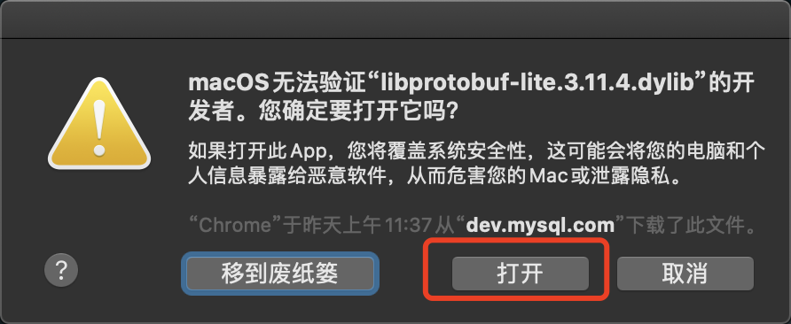

# Mac本地搭建MySQL一主两从集群实验

### 1、实验环境
```shell script
MacBook Pro (16-inch, 2019)
处理器 2.3 GHz 八核Intel Core i9
内存 16 GB 2667 MHz DDR4
```

[参考链接](https://www.cnblogs.com/holddie/p/14079223.html)

### 2、下载安装包
[MySQL官网免安装包下载](https://dev.mysql.com/downloads/mysql/)
选择免安装的包，如下图所示：


因为本次实验的是一主两从的集群环境搭建，因此需要将下载下来的包解压三次，
分别命名为`master`、`slave1`、`slave2`：


### 3、初始化数据库

进入命令行，我这里用的是iTerm2，进入到master目录下初始化数据库：
```shell script
bin/mysqld --defaults-file=/Users/wuwei/wuwei/mysql-MS-test/master/support-files/my.cnf --initialize-insecure
```
过程中会因为Mac安全权限的问题禁止打开，这个时候点击取消，然后进入`系统偏好设置`里面的`安全与隐私`处允许即可，多次弹出重复上述动作即可！




最终，终端中会输出如下内容，代表初始化成功：
```shell script
2021-10-21T14:56:01.641809Z 0 [Warning] [MY-010915] [Server] 'NO_ZERO_DATE', 'NO_ZERO_IN_DATE' and 'ERROR_FOR_DIVISION_BY_ZERO' sql modes should be used with strict mode. They will be merged with strict mode in a future release.
2021-10-21T14:56:01.641937Z 0 [System] [MY-013169] [Server] /Users/wuwei/wuwei/mysql-MS-test/slave2/bin/mysqld (mysqld 8.0.27) initializing of server in progress as process 26867
2021-10-21T14:56:01.643197Z 0 [Warning] [MY-013242] [Server] --character-set-server: 'utf8' is currently an alias for the character set UTF8MB3, but will be an alias for UTF8MB4 in a future release. Please consider using UTF8MB4 in order to be unambiguous.
2021-10-21T14:56:01.643871Z 0 [Warning] [MY-010159] [Server] Setting lower_case_table_names=2 because file system for /Users/wuwei/wuwei/mysql-MS-test/slave2/data/ is case insensitive
2021-10-21T14:56:01.658759Z 1 [System] [MY-013576] [InnoDB] InnoDB initialization has started.
2021-10-21T14:56:01.816790Z 1 [System] [MY-013577] [InnoDB] InnoDB initialization has ended.
2021-10-21T14:56:02.637110Z 0 [Warning] [MY-013746] [Server] A deprecated TLS version TLSv1 is enabled for channel mysql_main
2021-10-21T14:56:02.637148Z 0 [Warning] [MY-013746] [Server] A deprecated TLS version TLSv1.1 is enabled for channel mysql_main
2021-10-21T14:56:02.733464Z 6 [Warning] [MY-010453] [Server] root@localhost is created with an empty password ! Please consider switching off the --initialize-insecure option.
2021-10-21T14:56:03.626400Z 0 [System] [MY-013172] [Server] Received SHUTDOWN from user <via user signal>. Shutting down mysqld (Version: 8.0.27).
```
注意读一下这里的日志，如果有ERROR级别的日志，意味着失败，你需要解决日志里的问题。

### 4、启动数据库
将这三个初始化好的数据库逐个启动起来。

启动master：
```shell script
./bin/mysqld --defaults-file=/Users/wuwei/wuwei/mysql-MS-test/master/support-files/my.cnf
```

启动slave1：
```shell script
./bin/mysqld --defaults-file=/Users/wuwei/wuwei/mysql-MS-test/slave1/support-files/my.cnf
```

启动slave2：
```shell script
./bin/mysqld --defaults-file=/Users/wuwei/wuwei/mysql-MS-test/slave2/support-files/my.cnf
```

输出日志如下：
```shell script
2021-10-22T02:09:15.133212Z 0 [Warning] [MY-010915] [Server] 'NO_ZERO_DATE', 'NO_ZERO_IN_DATE' and 'ERROR_FOR_DIVISION_BY_ZERO' sql modes should be used with strict mode. They will be merged with strict mode in a future release.
2021-10-22T02:09:15.133739Z 0 [System] [MY-010116] [Server] /Users/wuwei/wuwei/mysql-MS-test/slave2/bin/mysqld (mysqld 8.0.27) starting as process 27787
2021-10-22T02:09:15.140239Z 0 [Warning] [MY-013242] [Server] --character-set-server: 'utf8' is currently an alias for the character set UTF8MB3, but will be an alias for UTF8MB4 in a future release. Please consider using UTF8MB4 in order to be unambiguous.
2021-10-22T02:09:15.144044Z 0 [Warning] [MY-010159] [Server] Setting lower_case_table_names=2 because file system for /Users/wuwei/wuwei/mysql-MS-test/slave2/data/ is case insensitive
2021-10-22T02:09:19.105373Z 1 [System] [MY-013576] [InnoDB] InnoDB initialization has started.
2021-10-22T02:09:19.206451Z 1 [System] [MY-013577] [InnoDB] InnoDB initialization has ended.
2021-10-22T02:09:19.435636Z 0 [Warning] [MY-013746] [Server] A deprecated TLS version TLSv1 is enabled for channel mysql_main
2021-10-22T02:09:19.435655Z 0 [Warning] [MY-013746] [Server] A deprecated TLS version TLSv1.1 is enabled for channel mysql_main
2021-10-22T02:09:19.437010Z 0 [Warning] [MY-010068] [Server] CA certificate ca.pem is self signed.
2021-10-22T02:09:19.437041Z 0 [System] [MY-013602] [Server] Channel mysql_main configured to support TLS. Encrypted connections are now supported for this channel.
2021-10-22T02:09:19.467296Z 0 [System] [MY-010931] [Server] /Users/wuwei/wuwei/mysql-MS-test/slave2/bin/mysqld: ready for connections. Version: '8.0.27'  socket: '/Users/wuwei/wuwei/mysql-MS-test/slave2/mysql.sock'  port: 33026  MySQL Community Server - GPL.
2021-10-22T02:09:19.467297Z 0 [System] [MY-011323] [Server] X Plugin ready for connections. Bind-address: '::' port: 33062, socket: /Users/wuwei/wuwei/mysql-MS-test/slave2/mysqlx.sock
```

尝试连接一下，可以看出来已经可以正确的连接上了：


### 5、主从配置

```shell script
# 进入master目录
cd wuwei/mysql-MS-test/master

# 连接master主库，进入MySQL命令行界面，这里的`-P`一定是大写的，不要写成小写的`p`
./bin/mysql -h 127.0.0.1 -uroot -P33006

Welcome to the MySQL monitor.  Commands end with ; or \g.
Your MySQL connection id is 11
Server version: 8.0.27 MySQL Community Server - GPL

Copyright (c) 2000, 2021, Oracle and/or its affiliates.

Oracle is a registered trademark of Oracle Corporation and/or its
affiliates. Other names may be trademarks of their respective
owners.

Type 'help;' or '\h' for help. Type '\c' to clear the current input statement.

mysql>


#创建一个用户，密码123456
mysql> create user 'masterSlaveSyncUser'@'%' identified by '123456';
Query OK, 0 rows affected (0.02 sec)

#授权远程同步
mysql> grant replication slave on *.* to 'masterSlaveSyncUser'@'%';
Query OK, 0 rows affected (0.01 sec)

#保存刷新
mysql> flush privileges;
Query OK, 0 rows affected (0.01 sec)

#查看主库状态
mysql> show master status;
+------------------+----------+--------------+------------------+-------------------+
| File             | Position | Binlog_Do_DB | Binlog_Ignore_DB | Executed_Gtid_Set |
+------------------+----------+--------------+------------------+-------------------+
| mysql-bin.000002 |      886 |              |                  |                   |
+------------------+----------+--------------+------------------+-------------------+
1 row in set (0.00 sec)

#查看主库日志
mysql> show master logs;
+------------------+-----------+-----------+
| Log_name         | File_size | Encrypted |
+------------------+-----------+-----------+
| mysql-bin.000001 |       179 | No        |
| mysql-bin.000002 |       886 | No        |
+------------------+-----------+-----------+
2 rows in set (0.00 sec)
```

这里面有两个命令：
* `show master status`：查看master数据库当前正在使用的二进制日志文件，以及当前执行的二进制日志位置，这个后面在从库中配置主库的时候要用到；
* `show master logs`：查看所有的二进制日志列表，执行输出和`show binary logs`一致；

```shell script
#进入slave1所在目录
cd wuwei/mysql-MS-test/slave1

#测试一下在slave1中使用刚刚创建的`masterSlaveSyncUser`用户连接主库 
./bin/mysql -h 127.0.0.1 -umasterSlaveSyncUser -P33006 -p
Enter password:

Welcome to the MySQL monitor.  Commands end with ; or \g.
Your MySQL connection id is 12
Server version: 8.0.27 MySQL Community Server - GPL

Copyright (c) 2000, 2021, Oracle and/or its affiliates.

Oracle is a registered trademark of Oracle Corporation and/or its
affiliates. Other names may be trademarks of their respective
owners.

Type 'help;' or '\h' for help. Type '\c' to clear the current input statement.

mysql>

#ok，没问题，退出
mysql> quit;
Bye

#连接slave1，进入自己的数据库
./bin/mysql -h 127.0.0.1 -uroot -P33016

Welcome to the MySQL monitor.  Commands end with ; or \g.
Your MySQL connection id is 10
Server version: 8.0.27 MySQL Community Server - GPL

Copyright (c) 2000, 2021, Oracle and/or its affiliates.

Oracle is a registered trademark of Oracle Corporation and/or its
affiliates. Other names may be trademarks of their respective
owners.

Type 'help;' or '\h' for help. Type '\c' to clear the current input statement.

mysql>

#设置主库信息
mysql> change master to master_host='127.0.0.1',master_port=33006,master_user='masterSlaveSyncUser',master_password='123456',master_log_file='mysql-bin.000002',master_log_pos=886;

Query OK, 0 rows affected, 8 warnings (0.01 sec)

#启动从库
mysql> start slave;

Query OK, 0 rows affected, 1 warning (0.00 sec)

#查看从库状态
mysql> show slave status;

+----------------------------------+-------------+---------------------+-------------+---------------+------------------+---------------------+-------------------------------------+---------------+-----------------------+------------------+-------------------+-----------------+---------------------+--------------------+------------------------+-------------------------+-----------------------------+------------+------------+--------------+---------------------+-----------------+-----------------+----------------+---------------+--------------------+--------------------+--------------------+-----------------+-------------------+----------------+-----------------------+-------------------------------+---------------+---------------+----------------+----------------+-----------------------------+------------------+--------------------------------------+-------------------------+-----------+---------------------+----------------------------------------------------------+--------------------+-------------+-------------------------+--------------------------+----------------+--------------------+--------------------+-------------------+---------------+----------------------+--------------+--------------------+------------------------+-----------------------+-------------------+
| Slave_IO_State                   | Master_Host | Master_User         | Master_Port | Connect_Retry | Master_Log_File  | Read_Master_Log_Pos | Relay_Log_File                      | Relay_Log_Pos | Relay_Master_Log_File | Slave_IO_Running | Slave_SQL_Running | Replicate_Do_DB | Replicate_Ignore_DB | Replicate_Do_Table | Replicate_Ignore_Table | Replicate_Wild_Do_Table | Replicate_Wild_Ignore_Table | Last_Errno | Last_Error | Skip_Counter | Exec_Master_Log_Pos | Relay_Log_Space | Until_Condition | Until_Log_File | Until_Log_Pos | Master_SSL_Allowed | Master_SSL_CA_File | Master_SSL_CA_Path | Master_SSL_Cert | Master_SSL_Cipher | Master_SSL_Key | Seconds_Behind_Master | Master_SSL_Verify_Server_Cert | Last_IO_Errno | Last_IO_Error | Last_SQL_Errno | Last_SQL_Error | Replicate_Ignore_Server_Ids | Master_Server_Id | Master_UUID                          | Master_Info_File        | SQL_Delay | SQL_Remaining_Delay | Slave_SQL_Running_State                                  | Master_Retry_Count | Master_Bind | Last_IO_Error_Timestamp | Last_SQL_Error_Timestamp | Master_SSL_Crl | Master_SSL_Crlpath | Retrieved_Gtid_Set | Executed_Gtid_Set | Auto_Position | Replicate_Rewrite_DB | Channel_Name | Master_TLS_Version | Master_public_key_path | Get_master_public_key | Network_Namespace |
+----------------------------------+-------------+---------------------+-------------+---------------+------------------+---------------------+-------------------------------------+---------------+-----------------------+------------------+-------------------+-----------------+---------------------+--------------------+------------------------+-------------------------+-----------------------------+------------+------------+--------------+---------------------+-----------------+-----------------+----------------+---------------+--------------------+--------------------+--------------------+-----------------+-------------------+----------------+-----------------------+-------------------------------+---------------+---------------+----------------+----------------+-----------------------------+------------------+--------------------------------------+-------------------------+-----------+---------------------+----------------------------------------------------------+--------------------+-------------+-------------------------+--------------------------+----------------+--------------------+--------------------+-------------------+---------------+----------------------+--------------+--------------------+------------------------+-----------------------+-------------------+
| Waiting for source to send event | 127.0.0.1   | masterSlaveSyncUser |       33006 |            60 | mysql-bin.000002 |                 886 | wuweideMacBook-Pro-relay-bin.000002 |           324 | mysql-bin.000002      | Yes              | Yes               |                 |                     |                    |                        |                         |                             |          0 |            |            0 |                 886 |             546 | None            |                |             0 | No                 |                    |                    |                 |                   |                |                     0 | No                            |             0 |               |              0 |                |                             |                1 | 2a57e52a-3181-11ec-bfda-939b50c0d2db | mysql.slave_master_info |         0 |                NULL | Replica has read all relay log; waiting for more updates |              86400 |             |                         |                          |                |                    |                    |                   |             0 |                      |              |                    |                        |                     0 |                   |
+----------------------------------+-------------+---------------------+-------------+---------------+------------------+---------------------+-------------------------------------+---------------+-----------------------+------------------+-------------------+-----------------+---------------------+--------------------+------------------------+-------------------------+-----------------------------+------------+------------+--------------+---------------------+-----------------+-----------------+----------------+---------------+--------------------+--------------------+--------------------+-----------------+-------------------+----------------+-----------------------+-------------------------------+---------------+---------------+----------------+----------------+-----------------------------+------------------+--------------------------------------+-------------------------+-----------+---------------------+----------------------------------------------------------+--------------------+-------------+-------------------------+--------------------------+----------------+--------------------+--------------------+-------------------+---------------+----------------------+--------------+--------------------+------------------------+-----------------------+-------------------+
1 row in set, 1 warning (0.01 sec)

#表格在终端不好看的话，可以执行`show slave status\G;`换种输出形式。
#注意其中`Slave_IO_Running`、`Slave_SQL_Running`的状态值必须为Yes的时候才表明同步是ok的。

```
在slave2中重复上述过程。

至此，MySQL的一主两从就配置好了。接下来我们测试验证一下。

```shell script
#主库下创建一个数据库
mysql> create database test_sync;
Query OK, 1 row affected (0.00 sec)

#从库slave1查一下数据库列表
mysql> show databases;
+--------------------+
| Database           |
+--------------------+
| information_schema |
| mysql              |
| performance_schema |
| sys                |
| test_sync          |
+--------------------+
5 rows in set (0.01 sec)

#从库slave2查一下数据库列表
mysql> show databases;
+--------------------+
| Database           |
+--------------------+
| information_schema |
| mysql              |
| performance_schema |
| sys                |
| test_sync          |
+--------------------+
5 rows in set (0.01 sec)

#主库创建一张表
mysql> use test_sync;

Database changed

mysql> CREATE TABLE `test` (
    ->   `id` int(10) unsigned NOT NULL AUTO_INCREMENT COMMENT '主键Id',
    ->   `name` int(10) NOT NULL DEFAULT 0 COMMENT '名称',
    ->   `create_time` datetime NOT NULL DEFAULT now() COMMENT '创建时间',
    ->   `update_time` timestamp NULL DEFAULT NULL ON UPDATE CURRENT_TIMESTAMP COMMENT '更新时间',
    ->   PRIMARY KEY (`id`),
    ->   KEY `idx_name` (`name`) USING BTREE COMMENT '根据name查询'
    -> ) ENGINE=InnoDB AUTO_INCREMENT=1 CHARSET=utf8mb4 COMMENT='测试表';

Query OK, 0 rows affected, 2 warnings (0.01 sec)

mysql> show tables;
+---------------------+
| Tables_in_test_sync |
+---------------------+
| test                |
+---------------------+
1 row in set (0.00 sec)

#从库slave1查看一下表
mysql> show tables;
+---------------------+
| Tables_in_test_sync |
+---------------------+
| test                |
+---------------------+
1 row in set (0.00 sec)

#从库slave2查看一下表
mysql> show tables;
+---------------------+
| Tables_in_test_sync |
+---------------------+
| test                |
+---------------------+
1 row in set (0.00 sec)
```

### 结束
这样一个简单的一主两从就搭建完成了，相对还是简单的，建议大家跟着教程自己搭建一遍，一定要动手实操。
完成了一主两从后，其实大家可以继续深入研究一下，这样的结构都存在哪些问题？比如延迟问题？主挂了怎么办？等等。


