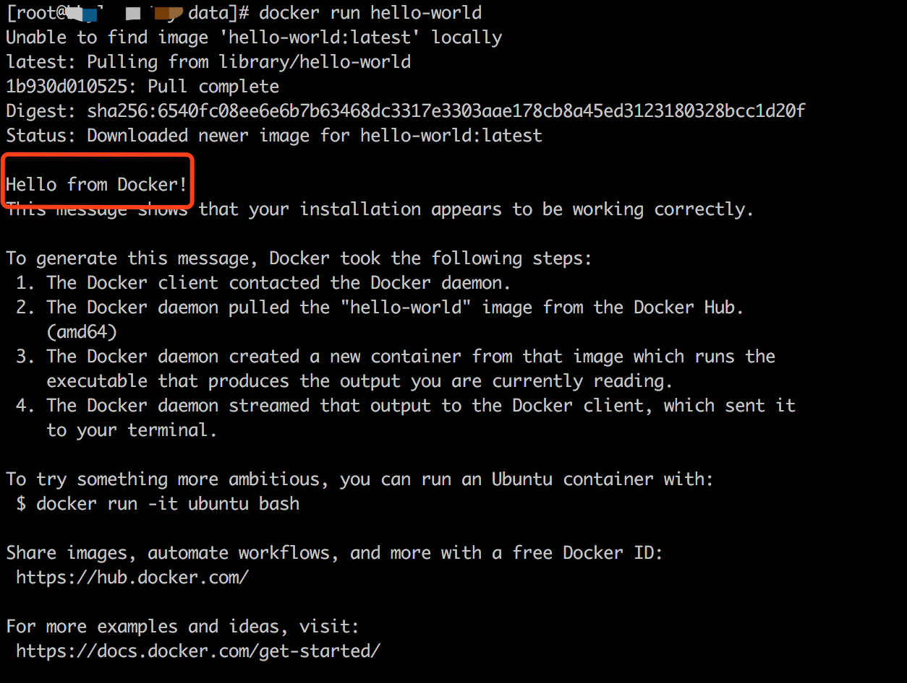
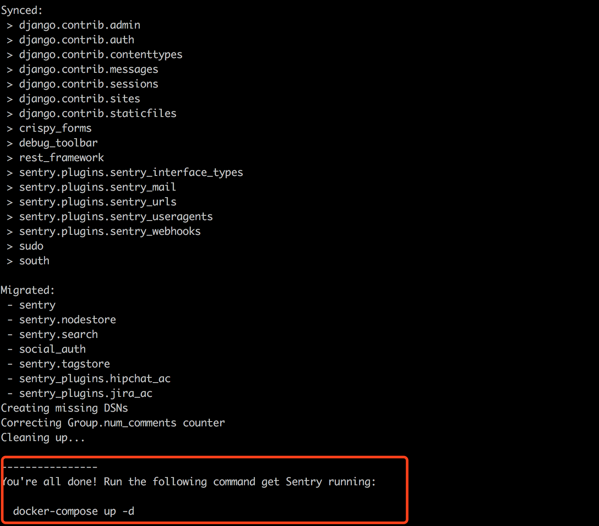

### linux下安装sentry

- centOS7.4
- Docker version 18.09.8

```jshelllanguage
#保证yum源最新
yum update

#安装依赖包
yum install -y yum-utils device-mapper-persistent-data lvm2

#添加稳定的源
yum-config-manager --add-repo https://download.docker.com/linux/centos/docker-ce.repo

#安装docker-ce
yum makecache fast
yum install docker-ce

#启动docker服务
systemctl start docker

#测试
docker run hello-world

#查看docker版本
docker --version
#输出：Docker version 18.09.8, build 0dd43dd87f

#安装docker-compose
yum install -y docker-compose

#git安装
yum install git

#下载sentry源码到本地
git clone https://github.com/getsentry/onpremise.git

#创建docker数据卷
docker volume create --name=sentry-data
docker volume create --name=sentry-postgres

#执行
cp -n .env.example .env

#更新和运行
docker-compose run --rm web config generate-secret-key
-----------------------
镜像下载中...
-----------------------
#把上面命令得到的key保存到.env文件下的最后一行，当做环境变量

#直接执行install.sh一步到位
sh install.sh

#运行sentry
docker-compose up -d
```

###测试docker


### Sentry安装完毕



