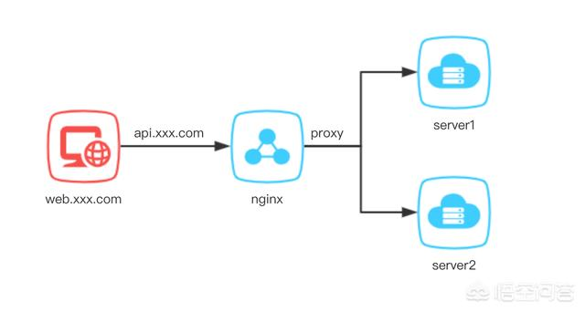
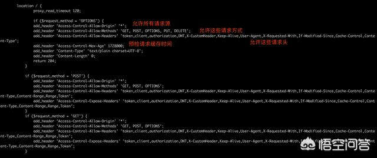
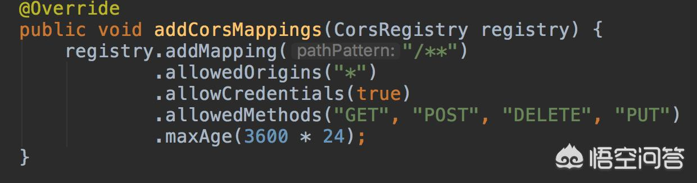

## 前后端分离，如何解决跨域问题？
前后端分离项目跨域问题是不可避免的。通常情况下前端由React、Vue等框架编写，通过ajax请求服务端API，传输数据用json格式。

    那么为什么有跨域的问题呢？
    解决跨域问题有哪些方式？
    搞清楚这两个问题我们需要了解一下什么是同源策略。
    
#### 浏览器的同源策略
同源策略（Same origin policy）是一种安全约定，是所有主流浏览器最核心也是最基本的安全功能之一。同源策略规定：不同域的客户端脚本在没有明确授权的情况下，不能请求对方的资源。同源指的是：域名、协议、端口均相同。

比如我们访问一个网站:http://www.test.com/index.html

那么这个页面请求如下地址得情况是这样的:

|    网   址                                | 结果  | 原因               |
|:-----------------------------------------|:----:| ------------------:|
| http://www.test.com/index.html           | 通过  | 域名、协议、端口均相同 |
| https://www.test.com/index.html          | 失败  | 协议不一致https      |
| https://www.test.com:8080/index.html     | 失败  | 端口不一致8080       |
| https://www.test.cn:8080/index.html      | 失败  | 域名不一致cn         |

另外，同源策略又分如下两种情况：

* DOM同源策略：禁止对不同源的页面DOM进行操作，主要防止iframe的情况。比如iframe标签里放一个支付宝付款的页面，如果没有同源策略，那么钓鱼网站除了域名不同，其他的则可以和支付宝的网站一模一样。
* XMLHttpRequest同源策略：禁止使用XHR对象向不同源的服务器发起http请求。比如网站记录了银行的cookie，这个时候你访问了恶意网站，黑客拿到你的cookie，再通过ajax请求之前的银行网站，便可以轻易的拿到你的银行信息。

所以，正是因为有了同源策略，大家的网络环境才相对的安全一些。

#### 跨域问题的解决办法

了解了同源策略，就知道为什么会有跨域问题的产生了，都是为了安全。

但是实际研发中，大家还是需要跨域去访问资源。典型的应用场景就是前后端分离的项目了。那么我们如何去解决跨域问题呢？

#### CORS-跨域资源共享
CORS是一种W3C标准，定义了当产生跨域问题的时候，客户端与服务端如何通信解决跨域问题。实际上就是前后端约定好定义一些自定义的http请求头，让客户端发起请求的时候能够让服务端识别出来该请求是过还是不过。

浏览器将CORS请求分为<label style="color:red">简单请求</label>和<label style="color:red">非简单请求</label>：
###### 简单请求
简单请求必须满足以下两个条件：

* 请求方式必须是HEAD、GET、POST三种方法之一;
* Http请求头必须只能是：`Accept`、`Accept-Lanuage`、`Content-Lanuage`、`Last-Event-ID`、`Content-Type`，其中Content-Type只限于三个值 `application/x-www-form-urlencoded`、`multipart/form-data`、`text/plain`。

###### 非简单请求
不满足简单请求条件的就是非简单请求。针对非简单请求，浏览器会发起预检请求。预检请求的意思是当浏览器检查到你的页面含有跨域请求的时候，会发送一个`OPTIONS`请求给对应的服务器，以检测服务器是否允许当前域名的跨域请求。如果服务端允许该域名请求，则返回204或200状态码，浏览器接收到允许请求时候再继续发送对应的`GET/POST/PUT/DELETE`请求。同时服务器端也会告知浏览器预检请求的缓存时长是多少，在这个时间范围内，浏览器不会再次发起预检请求。

原理基本上就是上面说的这些，实际业务中我们如何通过配置来解决跨域问题呢？

基本上常见的就是三种方式：

* nginx配置

* jsonp
因为script标签是不受浏览器同源策略的影响，允许跨域请求资源（我们的每一个页面都引用了大量第三方js文件）。所以可以利用动态创建script标签，通过src属性发起跨域请求，这就是jsonp的原理。但是jsonp只支持GET请求，所以并不是一种好的方式。

* 服务端代码控制

这种方式相当于全局过滤器，对所有请求都过滤一遍。

以上三种方式都可以一定程度上解决跨域问题，但是nginx配置和服务端控制不能同时存在，否则会报`Access-Control-Allow-Origin Not Allow Multiple value`的错误。

个人比较推荐nginx配置的方式，一劳永逸，不需要每个web项目都去编写跨域的代码。

